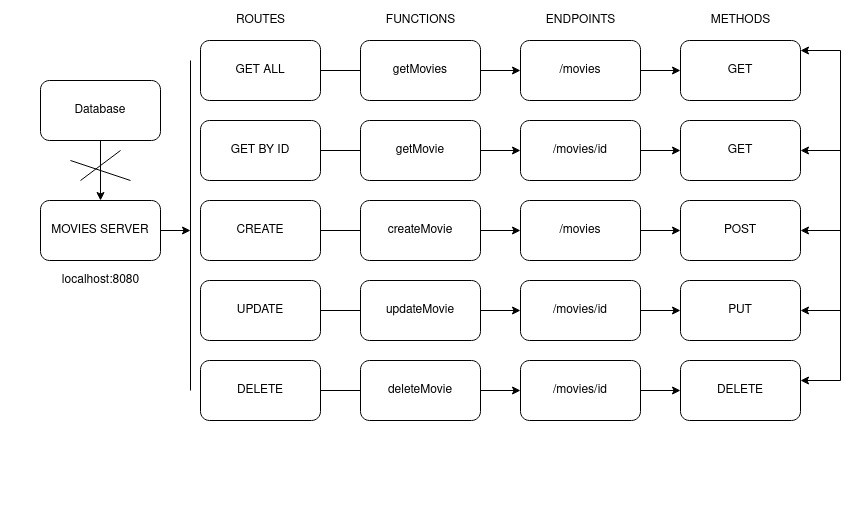

# Golang CRUD APIs
Building a Simple backend service with CRUD operation.

## Commands
        make build
        make start

## Overview (no real database support)

### Results
    
    LIST: http://localhost:8000/movies
    Response:
    [
        {
            "id": "1",
            "isbn": "438227",
            "title": "Movie One",
            "director": {
                "firstname": "John",
                "lastname": "Cena"
            }
        },
        {
            "id": "81",
            "isbn": "456498",
            "title": "Movie Something",
            "director": {
                "firstname": "Jane",
                "lastname": "Cena"
            }
        },
        {
            "id": "87",
            "isbn": "456498",
            "title": "Movie Something",
            "director": {
                "firstname": "Jane",
                "lastname": "Cena"
            }
        },
        {
            "id": "",
            "isbn": "456498",
            "title": "Movie Something",
            "director": {
                "firstname": "Jane",
                "lastname": "Woohoo!"
            }
        }
    ]

    CREATE: http://localhost:8000/movies
    Payload: 
    {
        "isbn": "456498",
        "title": "Movie Something",
        "director": {
            "firstname": "Jane",
            "lastname": "Cena"
        }
    }
    Reponse:
    {
        "id": "47",
        "isbn": "456498",
        "title": "Movie Something",
        "director": {
            "firstname": "Jane",
            "lastname": "Cena"
        }
    }

    RETRIEVE: http://localhost:8000/movies/2
    Response:
    {
        "id": "2",
        "isbn": "456444",
        "title": "Movie Two",
        "director": {
            "firstname": "Jane",
            "lastname": "Cena"
        }
    }
    

    UPDATE: http://localhost:8000/movies/47
    Payload:
    {
        "id": "47",
        "isbn": "456498",
        "title": "Pulp Fiction",
        "director": {
            "firstname": "Quentin",
            "lastname": "Tarantino"
        }
    }
    Response:
    {
        "id": "47",
        "isbn": "456498",
        "title": "Pulp Fiction",
        "director": {
            "firstname": "Quentin",
            "lastname": "Tarantino"
        }
    }
    

    DELETE: http://localhost:8000/movies/2
    Response: 
    {}